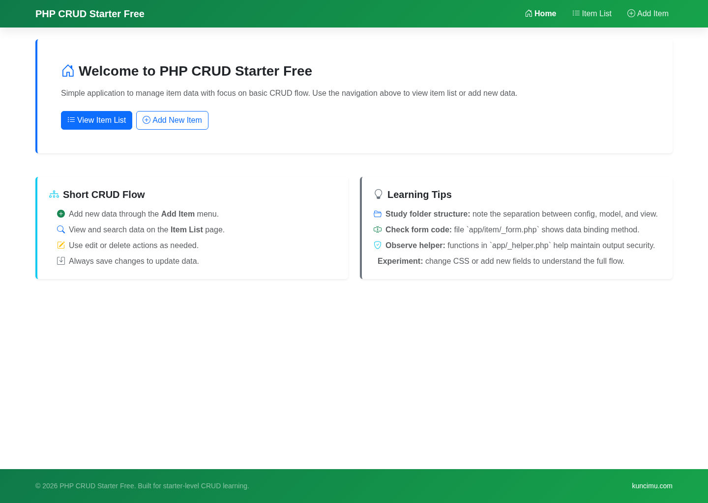
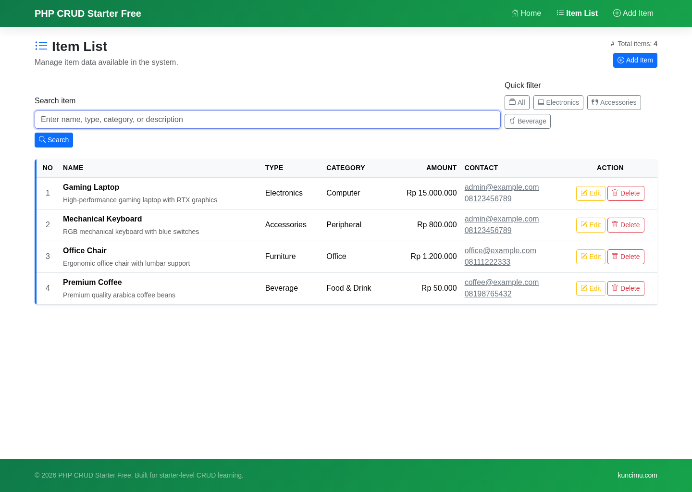
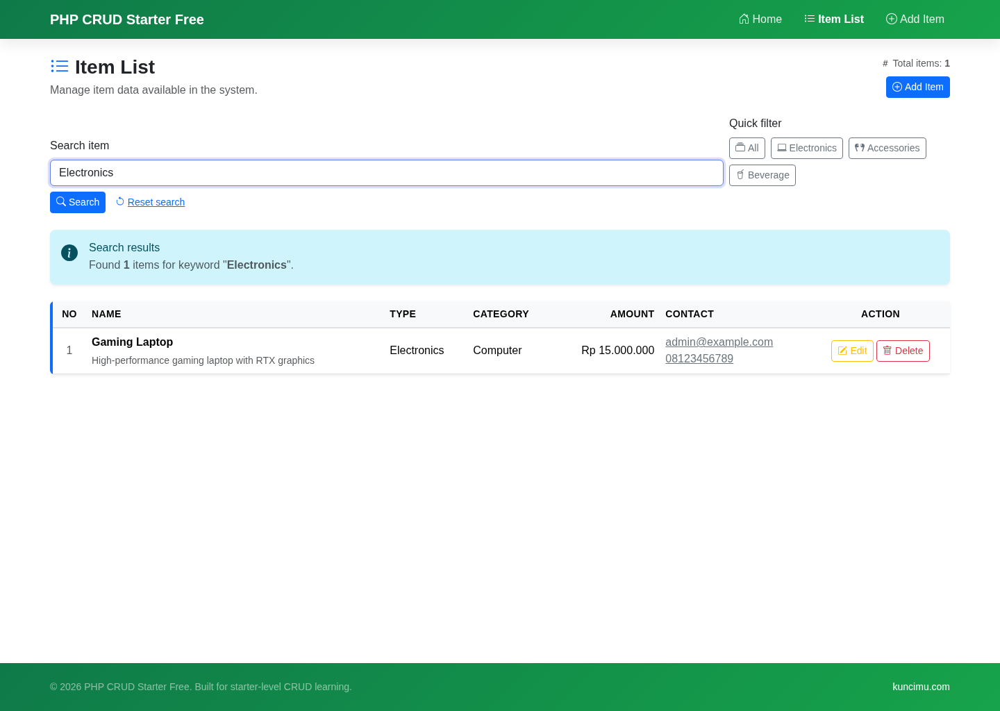
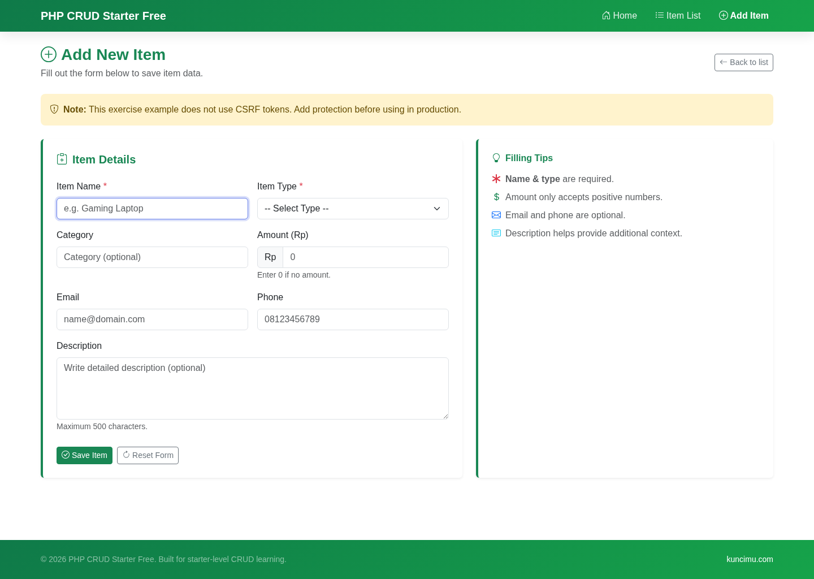

<!--
  Scaffolded by Andi UPN (https://github.com/andiupn)
  Official Website & Support: https://kuncimu.com
  Licensed under MIT License
-->

# PHP 本机 CRUD 入门

  <a href="README.md">English</a> | <a href="README.id.md">Bahasa Indonesia</a> | <strong>简体中文</strong> | <a href="README.hi.md">हिन्दी</a> | <a href="README.fr-ca.md">Français (CA)</a> | <a href="README.de.md">Deutsch</a> | <a href="README.fr.md">Français</a> | <a href="README.pt-br.md">Português (BR)</a> | <a href="README.vi.md">Tiếng Việt</a> | <a href="README.pl.md">Polski</a> | <a href="README.ja.md">日本語</a> | <a href="README.ko.md">한국어</a> | <a href="README.es.md">Español</a> | <a href="README.tr.md">Türkçe</a> | <a href="README.it.md">Italiano</a> | <a href="README.ru.md">Русский</a> | <a href="README.uk.md">Українська</a> | <a href="README.nl.md">Nederlands</a> | <a href="README.sv.md">Svenska</a> | <a href="README.ro.md">Română</a>

 

__徽章_0__
__徽章_1__
__徽章_2__
__徽章_3__

初学者优先的原生 PHP CRUD 入门工具，用于手动学习和 AI 辅助编码，并具有公共捐赠路径，有助于保持免费套餐的稳定。

主要 CTA：[捐赠以支持免费维护](https://github.com/sponsors/andiupn?frequency=monthly)
辅助 CTA：[升级到 PreBasic 或 Basic 以获取更强的级别](https://github.com/sponsors/andiupn?frequency=monthly)

## 此级别适合谁

- 初次编程者和刚出生 0-6 个月的学生。
- 想要了解普通 PHP 页面如何连接到真实 SQLite CRUD 流程的初学者。
- 在要求 AI 工具修改代码之前想要一个小型、稳定的参考的开发人员。

## 最适合

- 学习 CRUD 基础知识，无需框架抽象。
- 研究易于追踪的简单路线和视图流程。
- 使用可运行的基线进行手动编码和 AI 氛围编码提示。

## 不适合

- 已经需要 CSRF 保护和可搜索数据表的买家。
- 已经需要控制器、模型和视图边界的初级程序员。
- 已经需要仪表板、报告或设置的商业内部工具工作。

## 为什么选择这个级别

启动器的存在是为了消除摩擦。它为您提供了一个小型的原生 PHP CRUD，它已经运行，保持可读，并且公开完整的请求到数据库的路径，而无需大量抽象。

## 为什么要从上一级升级

Starter 是入门级。当您想要更安全的表单、DataTables 列表可用性以及更干净的初学者到初级过渡而不直接跳入更大的项目结构时，请转向 PreBasic。

## 当前包含的产品

|产品 |数据库|状态 |笔记|
| ---| ---| ---| ---|
| [`php-native-crud-starter`](php-native-crud-starter) | SQLite |活跃|针对初学者的当前可运行的原生 PHP 基线。 |

计划在这一层中心的未来兄弟姐妹：

- __内联_9__
- __内联_10__

## 原生阶梯的功能差异

|能力|入门 |基础知识 |基本 |进阶|专业|
| ---| ---| ---| ---| ---| ---|
|今天建立的数据库 | SQLite | SQLite | SQLite + MySQL | MySQL | MySQL |
|数据表 UI |没有 |是的 |是的 |是的 |是的 |
|表单上的 CSRF |没有 |是的 |是的 |是的 |是的 |
|控制器、模型和视图结构 |没有 |没有 |是的 |是的 |是的 |
|仪表板|没有 |没有 |没有 |是的 |是的 |
|过滤器和 CSV 导出 |没有 |没有 |没有 |是的 |是的 |
|报告、活动日志、设置 |没有 |没有 |没有 |没有 |是的 |
|接入方式 |公众捐款|付费/私人 |付费/私人 |付费/私人 |付费/私人 |

## 为什么支持这个项目

捐赠使免费套餐保持有用而不是陈旧。支持资金：

- 公共 SQLite 启动器的维护
- Docker 和冒烟测试验证
- 文档、屏幕截图和入门润色
- 付费等级建立在较低等级的基础上

自由意味着感到慷慨，而不是被抛弃。捐赠有助于兑现这一承诺。

## 截图

完整屏幕截图集：[`php-native-crud-starter/docs/screenshots/`](php-native-crud-starter/docs/screenshots)

## 社交预览

GitHub 社交卡图像：[`php-native-crud-starter/assets/social-preview.png`](php-native-crud-starter/assets/social-preview.png)

### 家庭桌面

### 物品列表桌面

### 物品搜索桌面

### 创建表单桌面

## 快速入门

__代码_块_0__

打开：

__代码_块_1__

## 验证

__代码_块_2__

## 目前状态

- 回购可见性：公开
- 当前层状态：活跃
- 今天包含的产品：`php-native-crud-starter`
- 分配模式：原生首发线的公共捐赠中心

## 赞助商/访问路径

- 捐赠以支持免费维护：[GitHub 赞助商](https://github.com/sponsors/andiupn?frequency=monthly)
- 需要更安全或更商业的层级：移至 `PreBasic`、`Basic`、`Advance` 或 `Pro`
- 此存储库中的信任表面：[CHANGELOG.md](CHANGELOG.md)、[CONTRIBUTING.md](CONTRIBUTING.md)、[SECURITY.md](SECURITY.md)、[DONATE.md](DONATE.md)