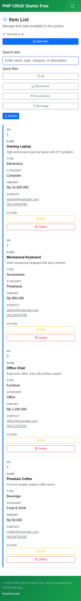

# PHP Native CRUD Starter

<div align="center">
  <a href="README.md">English</a> | <a href="README.id.md">Bahasa Indonesia</a> | <a href="README.zh.md">简体中文</a> | <a href="README.hi.md">हिन्दी</a> | <a href="README.fr-ca.md">Français (CA)</a> | <a href="README.de.md">Deutsch</a> | <a href="README.fr.md">Français</a> | <a href="README.pt-br.md">Português (BR)</a> | <a href="README.vi.md">Tiếng Việt</a> | <a href="README.pl.md">Polski</a> | <a href="README.ja.md">日本語</a> | <a href="README.ko.md">한국어</a> | <a href="README.es.md">Español</a> | <a href="README.tr.md">Türkçe</a> | <a href="README.it.md">Italiano</a> | <a href="README.ru.md">Русский</a> | <strong>Українська</strong> | <a href="README.nl.md">Nederlands</a> | <a href="README.sv.md">Svenska</a> | <a href="README.ro.md">Română</a>
</div>

Двомовний: [🇮🇩 Bahasa Indonesia](README.id.md) | [🇺🇸 англійською](README.md)

Початкове видання, зручне для пожертвувань, для тих, хто вперше вивчає програмування, нових студентів у 0–6 місяцях і всіх, кому потрібен приклад CRUD, який дійсно працює.

Він також корисний як стабільний еталонний код для кодування AI vibe: програма вже запущена, тому редагування за допомогою AI мають конкретну базову лінію, якої слід дотримуватися.

## Попередній перегляд


## Кращі візуальні ефекти

<table>
  <tr>
    <td align="center"><br>Домашня</td>
    <td align="center"><br>Пошук</td>
    <td align="center"><br>Створити</td>
  </tr>
</table>

Цей вигляд навмисно простий: прості сторінки CRUD, зрозуміла маршрутизація та відсутність важчого рівня інтерфейсу користувача.

## Аудиторія

- Вперше вивчають програмування.
- Нові студенти PHP у перші 0-6 місяців.
- Початківці, яким потрібен читабельний код перед вивченням фреймворків.

## Найкраще для

- Вивчення того, як сторінка CRUD підключається до бази даних.
- Запуск невеликої програми Native PHP без складного налаштування.
- Надання інструменту кодування штучного інтелекту простої стабільної базової лінії для модифікації.

## Не для

- Користувачі, яким потрібні DataTables, CSRF або більш досконалий платний стартовий пристрій.
- Молодші програмісти, яким вже потрібна формальна структура проекту.

## Чому цей рівень

Закуска повинна здаватися щедрою, а не дешевою. Він робить програму достатньо малою для розуміння, водночас доводячи, що повний цикл CRUD працює.

## Навіщо оновлюватися

Перейдіть на PreBasic, якщо вам потрібні офлайн-активи, таблиці даних, безпечніше надсилання форм і повніша документація.

## Використання ручного кодування

Запустіть програму, прочитайте один маршрут за раз, відредагуйте одне поле форми, а потім перевірте результат у браузері.

## Використання кодування AI Vibe

Використовуйте це видання як першу стабільну підказку. Попросіть ШІ зберегти поточний стиль маршруту/перегляду та перевіряти кожну зміну за допомогою команд репо.

## Запуск із Docker

```bash
docker compose up --build
```

відкритий:

```text
http://localhost:8081
```

## Маршрути

- Дім: `http://localhost:8081/`
- Список предметів: `http://localhost:8081/?route=item/index`
- Створити елемент: `http://localhost:8081/?route=item/create`

## Скріншоти

Повний набір знімків екрана: [`docs/screenshots/`](docs/screenshots)

### Домашній робочий стіл


### Робочий стіл пошуку списку елементів


### Робочий стіл списку елементів


### Список товарів Mobile



### Створити робочий стіл форм


## Метадані

- Слимак: `php-native-crud-starter`
- Рівень: `starter`
- Сервер: `native`
- Інтерфейс: `html`
- База даних: `sqlite`
— Середа виконання: Docker PHP 8.3 Apache
- Розподіл: громадська пожертва

## Файли

- `app/` містить логіку представлення та моделі.
- `config/` містить керовану env конфігурацію та налаштування бази даних.
- `public/` є коренем веб-сайту.
- `db/database.sqlite` — локальна база даних SQLite.

## Пожертвування

Див. `DONATE.md`.

## Команди перевірки

З цього автономного сховища:

```bash
./scripts/lint.sh
./scripts/smoke.sh
```